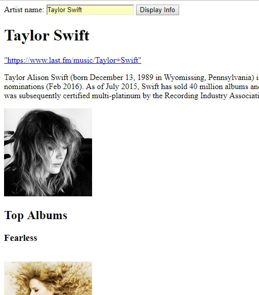
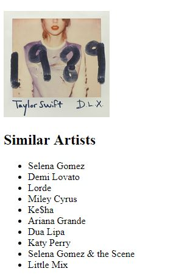

# Musicophile
last.fm API , JavaScript

An application to search information about your favourite music artists.
The information obatined includes the artist's
- Picture
- Biography
- Top albums
- Related artists
- A link to their last.fm page

------------------------------------------------------------

## How to run ?

Clone the repository into your htdocs diretory under xampp. 
Insert your API key for last.fm in music.js
Run Apache server
Open music.html on the browser

## Contributing

1. Fork it!
2. Create your feature branch: `git checkout -b my-new-feature`
3. Commit your changes: `git commit -am 'Add some feature'`
4. Push to the branch: `git push origin my-new-feature`
5. Submit a pull request :D

## License

Abhinaya Ramachandran 2017
